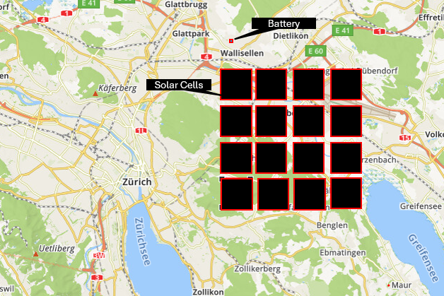

# SOLAR POWER PROJECT FOR ZURICH — SUMMARY

## Key Solar Facts
| Parameter | Value |
|-----------|-------|
| Peak solar irradiance (ground level) | 1,000 W/m² |
| Theoretical max efficiency (single-junction) | 33.7% (Shockley-Queisser limit) |
| Practical panel efficiency | ~20% at 25°C |
| Efficiency loss per °C | –0.45% |

## Zurich Energy Demand
| Metric | Amount |
|--------|--------|
| City population | ~440,000 |
| Annual electricity demand | ~3.3 TWh |
| **Average power required** | **~380–400 MW** |
| Daily energy requirement | ~9 GWh |

## Solar Panel Performance in Zurich
**Conditions:** 3.7 kWh/m²/day average insolation, panel temp ~35°C, efficiency ~19.1%

| Area | Daily Output | Peak Midday |
|------|--------------|------------|
| 1 km² | 707 MWh (~29.5 MW avg) | ~60 MW |
| 17 km² | 12 GWh (~500 MW avg) | ~1,000 MW peak |

## Energy Storage Requirement
To make solar feasible with peak demand coverage:

| Scenario | Battery Volume | Equivalent |
|----------|----------------|------------|
| 4 hours peak storage | **13,500 m³** | 116 m × 116 m square |
| 12 hours night coverage | ~40,000 m³ | Larger facility |

**Cost estimate:** ~$300–400M for 2,600 MWh lithium polymer battery

## Zurich Solar Project Specs
| Component | Requirement |
|-----------|-------------|
| Solar panel area needed | **~17 km²** |
| Average output | **500 MW** |
| Battery storage (4-hr coverage) | **13,500 m³** |
| Total system capacity | Peak: ~1,000 MW |

## Comparison: California vs. Zurich
Zurich requires **~30–40% more area** than California deserts for equivalent power due to lower solar irradiance (3.7 vs. 6.0 kWh/m²/day).

---
*Summary from Solar_Cells.md analysis*
*2026.07.28 GitHub Copilot*

