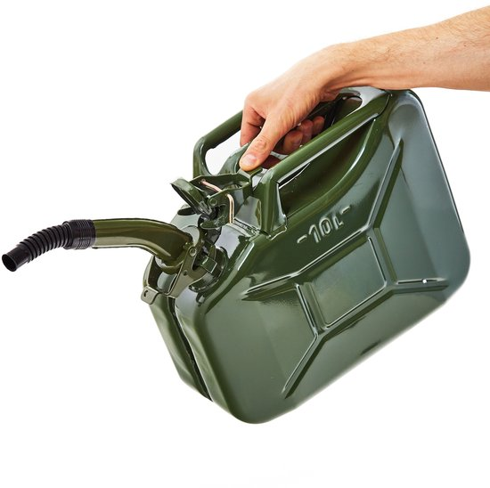
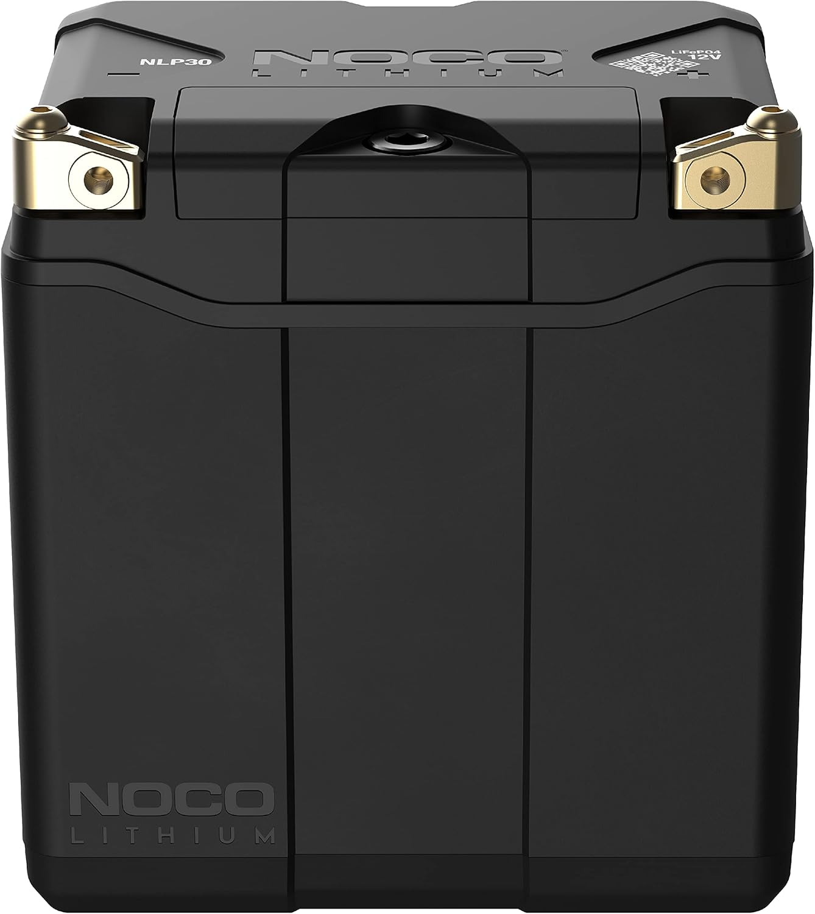

## SOLAR POWER CAR

# Index
- [ENERGY DENSITY (kg)](#energy-density-kg)
- [WATER RESEVOUR](#water-resevour)
- [ENERGY DENSITY ( per dm cube )](#energy-density-dm2)   
- [ENERGY CONVERSION EFICIENCY](#energy-conversion-eficiency)
- [MECHANICAL ENERGY DENSITY](#q5-redo-table-in-q1-using-mechanical-energy-to-wheels)


# ENERGY DENSITY (kg)

## Q1. Show a table of different energy content per 10kg of:
- Coal
- dry wood
- petrol
- oil
- dry protien
- dry starch
- sugar
- lithium battery (in cars)
- lead battery
  make reasonable assumptions to simplify table to show ballpark values.

### AI,Q1 ANSWER :

| Material | Assumed energy density | Energy in 10 kg | kWh in 10 kg | Notes |
|---|---:|---:|---:|---|
| Coal | ~25 MJ/kg | ~250 MJ | ~69 kWh | Typical bituminous coal |
| Dry wood | ~15 MJ/kg | ~150 MJ | ~42 kWh | Air-dry biomass |
| Petrol | ~43 MJ/kg | ~430 MJ | ~119 kWh | Gasoline |
| Oil | ~42 MJ/kg | ~420 MJ | ~117 kWh | Crude / fuel oil |
| Dry protein | ~17 MJ/kg | ~170 MJ | ~47 kWh | Approximate food-energy value |
| Dry starch | ~17 MJ/kg | ~170 MJ | ~47 kWh | Approximate carbohydrate energy |
| Sugar (sucrose) | ~17 MJ/kg | ~170 MJ | ~47 kWh | Typical dry sugar; similar to starch |
| Lithium battery (EV pack) | ~180 Wh/kg | ~1.8 kWh | ~1.8 kWh | Typical modern Li-ion pack |
| Lead battery | ~35 Wh/kg | ~0.35 kWh | ~0.35 kWh | Typical lead-acid pack |

Approximate assumptions: energy density values are ballpark and vary by quality, moisture, and battery chemistry. 
Sugar is included as a dry carbohydrate with a similar energy content to starch and protein, 
while batteries store far less energy per kilogram.

``` 
ASCII comparison (rough scale; each block ≈ 10 kWh):

Coal        ██████████████████████  ~69 kWh 
Petrol      ██████████████████████████  ~119 kWh
Oil         █████████████████████████  ~117 kWh
Dry wood    ████████████████  ~42 kWh
Dry starch  ████████████████  ~47 kWh
Sugar       ████████████████  ~47 kWh
Dry protein ████████████████  ~47 kWh
Li-ion batt ██  ~1.8 kWh
Lead batt   █  ~0.35 kWh

``` 

This makes the key point clear: a 10 kg fuel load stores roughly 100x more usable energy than a 10 kg lithium car battery.


2026.09.01 GitHub Copilot

| 10 kg 42kWh | 10 l 120 kWh | 1 kg 0.1 kWh 20x17x13 mm | Ruler 10 cm |
|---------|--------|--------|--------|
|  |  |  | |

# WATER RESEVOUR


## Q2. Convert 100 kwh to metric tons at height 100 m as resevoir of water 1 m deap and square in dimension:

### AI,Q2 ANSWER :
``` 
A 100 kWh energy store is roughly equivalent to lifting about 367 tonnes of water up 100 m.
For a 1 m deep reservoir, that means a square base of about 19 m × 19 m.

ASCII sketch: 100kW

The resivour is 86% of a standard 25 X 12.5 X 1.5 m short course swiming pool. 


                    ____________________
                   /                   / |
                  / Reservoir surface /  |
                 / 19 m x 19 m       /   |
                /___________________/   /
                |   1 m deep        |  /
                |                   | /
                +____________________/ 
                            ⇑                       
                            ⇑  100 m Height      
                            ⇑                       
    +=========================================+

This is the footprint area of the water needed for the stored energy
at 100 m height.

So in simple terms:
- 100 kWh is not huge in everyday terms
- but when stored as water at height, it needs a lot of mass and a large reservoir
- around 19 m × 19 m for a 1 m deep reservoir is a good ballpark picture

``` 

2026.09.01 GitHub Copilot

| 100 m Height | Water Reservoir | 
|---------|--------|
|  |  |

# ENERGY DENSITY ($dm^2$)

## Q3. Compare volume 100 kWh petrol to 100 kwh of lithium battery.

### AI,Q3 ANSWER :
``` 
Using ballpark energy densities:
- Petrol: about 8–10 kWh per litre (liter of water at 1 dm2)
- Li-ion battery pack: about 0.15–0.25 kWh per litre

So for 100 kWh:
- Petrol needs roughly 10–12 litres
- A lithium battery pack needs roughly 400–700 litres

That means the same amount of stored energy occupies far more space in a battery than in petrol.
In practical terms, a 100 kWh petrol tank is only a small fuel tank,
while a 100 kWh EV battery is a large, heavy module taking hundreds of litres of volume.
This is why batteries are much bulkier and heavier than liquid fuels for the same energy content,
even though they are cleaner and easier to recharge.
``` 

2026.09.01 GitHub Copilot

# ENERGY CONVERSION EFICIENCY 

## Q4. 100 kWh of petrol vs 100 kWh of battery , compare how this converts to KWh of mechanical energy:

### AI,Q4 ANSWER :
``` 
A rough comparison is:

- Petrol car (ICE): about 20–30% of the fuel energy becomes useful mechanical energy at the wheels.
  - 100 kWh of petrol ≈ 20–30 kWh of wheel power

- Battery-electric vehicle (EV): about 80–90% of the battery energy becomes useful mechanical energy at the wheels.
  - 100 kWh battery ≈ 80–90 kWh of wheel power

If charging losses are included, an EV may deliver closer to 70–80 kWh of usable wheel energy from 100 kWh taken from the grid,
but it is still far more efficient than petrol.

So, for the same stored energy:
- petrol car wastes most of its energy as heat
- EVs convert much more of that energy into motion

In simple terms, a 100 kWh battery can deliver roughly 3–4 times more useful mechanical energy than 100 kWh of petrol.
``` 
| Energy source | Typical efficiency to wheels | 100 kWh stored becomes | Main reason for loss |
|--------------|-----------------------------|------------------------|----------------------|
| Petrol (ICE) | 20–30% | ~20–30 kWh | Heat, friction, drivetrain losses |
| Battery EV | 80–90% | ~80–90 kWh | Motor/inverter/auxiliary losses |
| EV with charging losses | 70–80% | ~70–80 kWh | Charger + battery + drivetrain losses |

In simple terms, for the same 100 kWh of stored energy, 
an EV delivers roughly **3–4 times more useful mechanical energy** than a petrol car.


2026.09.01 GitHub Copilot


# MECHANICAL ENERGY CONVERSION EFICIENCY 
##  Q5. Redo Table in Q1 using mechanical energy to wheels 

### AI,Q5 ANSWER :

| Material | Energy stored in 10 kg | Typical efficiency to wheels | Useful wheel energy in 10 kg |
|---|---:|---:|---:|
| Petrol | ~119 kWh | ~25–30% | ~30–36 kWh |
| Lithium battery (EV pack) | ~1.8 kWh | ~80–90% | ~1.4–1.6 kWh |

``` 
Ballpark summary: even though 10 kg of petrol stores far more energy than 10 kg of lithium battery,
the battery converts a much larger share of that energy into wheel power.
So the EV still wins by a wide margin in useful mechanical energy per kilogram of stored energy.
``` 

2026.09.01 GitHub Copilot


##  Q6. How much mechanical energy is required to drive a 1000 kg can 500 km in flat Germany at 120 km/h: 
### AI,Q6 ANSWER :
``` 
A good ballpark for a 1000 kg car travelling 500 km on flat roads in Germany at 120 km/h is:

- around 0.15–0.25 kWh per km at highway speed
- so over 500 km: about 75–125 kWh of useful mechanical energy at the wheels
``` 

|  | 
|---|
| *A simple rule-of-thumb is:**  - 500 km × 0.2 kWh/km ≈ 100 kWh| 
|  | 

``` 
So the answer is roughly:
- 80–120 kWh of mechanical energy to the wheels
- with the exact value depending on aerodynamics, tire losses, speed, traffic, and whether the car is very efficient or heavier

This is the energy needed to overcome rolling resistance and aerodynamic drag on a flat road.
It does not include engine or drivetrain losses from the fuel side,
so a petrol car would need more stored fuel energy than this to deliver the same wheel energy.
``` 

2026.09.01 GitHub Copilot

##  Q7. Redu Q6 using kg of fuel and kg Battery: 

### AI,Q7 ANSWER :
| Item | Ballpark value |
|---|---:|
| Useful wheel energy for 500 km | ~80–120 kWh |
| Fuel energy needed (petrol ICE) | ~270–480 kWh |
| Petrol required | ~22–40 kg |
| Battery energy required (EV) | ~90–140 kWh |
| Battery mass required | ~450–700 kg |

``` 
Ballpark logic: to move a 1000 kg car 500 km on flat ground at 120 km/h, 
it needs roughly 80–120 kWh of useful mechanical energy at the wheels. 
A petrol engine turns only about 25–30% of fuel energy into wheel power, so it needs about 270–480 kWh of fuel energy, 
which is roughly 22–40 kg of petrol. An EV is much more efficient, needing only about 90–140 kWh from the battery, 
which corresponds to roughly 450–700 kg of a typical lithium pack. So the battery is far heavier for the same trip, 
even though it is much more efficient.
``` 

